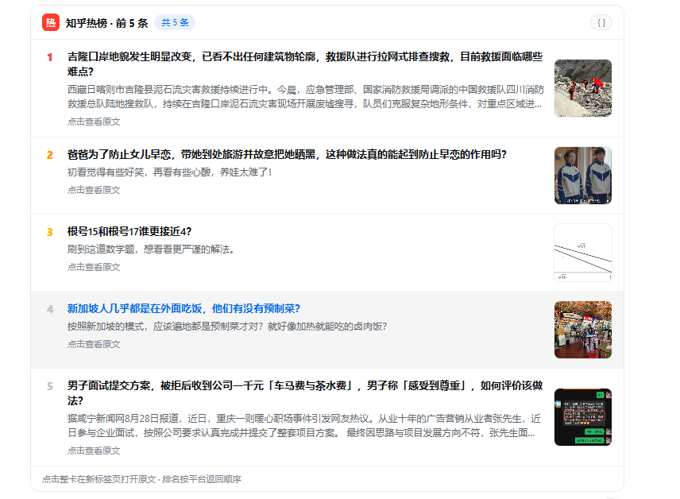

# dsh-zhihu-tools

知乎插件：宿主半部 18 个工具（读取 + 发布）+ 本地设置页，浏览器半部知乎设定页 + 工具卡片。

> **联系作者**：逐暝（leolee9086）· 点击链接加入群聊【工具软件爱好者折腾群-综合讨论】：https://qm.qq.com/q/RAHJuyhQQ （群号 1017854502，群主 逐暝）

## 安装

> **⚠️ 安全提示**：任何第三方插件——包括本插件——都应被视为天然不安全、不可信的代码。相比原样安装本插件，**更建议让你的 AI 参考本仓库源码自行重新实现**所需功能；若仍要安装，请先通读全部源码确认无恶意行为。

```bash
dsh plugin --profile web add dsh-zhihu-tools
# 或本地链入开发版
# dsh plugin --profile web add link:D:/dev/zhihu-plugin
```

重启 `dsh web` 并刷新 `http://127.0.0.1:3080` 后，`设置 → 知乎` 可配置凭证，工具 `zhihu_hot` 等可在对话中调用。

## 界面截图

知乎热榜工具卡（真实运行结果）：



## 架构

```
lib/index.js   宿主：18 工具，本地设置后端，白名单仅限知乎域名，内置限流与退避
lib/client.js  浏览器：ModuleLoader factory，手写卡片样式，工具视图严格隔离
cordis.patch.yml  包自带 bundle 补丁层
```

## 工具（18）

`zhihu_hot`、`zhihu_search`、`zhihu_global_search`、`zhihu_ask`、`zhihu_kb_list`、`zhihu_kb_items`、`zhihu_kb_upload`、`zhihu_kb_search`、`zhihu_pdf_parse`、`zhihu_ppt_generate`、`zhihu_task_query`、`zhihu_my_contents`、`zhihu_my_followees`、`zhihu_my_collections`、`zhihu_my_favlists`、`zhihu_favlist_contents`、`zhihu_auth_status`、**`zhihu_publish_article`**

前 17 个为读取类，均配备定制卡片；`zhihu_publish_article` 为发布类，走通用卡片。

## 发布文章（`zhihu_publish_article`）

支持**两种授权**，用 `auth_mode` 选择：

| auth_mode | 走哪条路 | 前提 |
|---|---|---|
| `auto`（默认） | 有 OpenAPI 凭证就用它，否则回落到网页会话 | — |
| `openapi` | 官方 Publish OpenAPI：`POST https://openapi.zhihu.com/openapi/publish`，`X-Sign = Base64(HMAC-SHA256("app_key:…\|ts:…\|logid:…\|extra_info:…", APP_SECRET))` | `ZHIHU_OPENAPI_APP_KEY`（= 知乎主页 URL 里的用户名，免申请）+ `ZHIHU_OPENAPI_APP_SECRET`（[开放平台申请](https://www.zhihu.com/playground/zhihu-publisher)，目前内测）；也可写入 `~/.zhihu/openapi-credentials.json` |
| `session` | 网页会话三步：建草稿 → 写草稿 → 发布（`zhuanlan.zhihu.com/api/articles`） | 已扫码登录，cookie 里有 `z_c0` 与 `_xsrf` |

**发布不可撤销，所以有两道关：**

1. **工具层默认不发**：不传 `confirm` 时只回显将要发送的请求体与所选授权方式供复核，必须显式传 `confirm=true` 才会走到发布；
2. **平台层强制授权**：即使传了 `confirm=true`，插件注册的 `tools/pre-execute` 守卫也会返回 `ask`，把这次调用交给 **DSH 的审批通道**由用户裁决；只有用户批准（`allowed-once`）才真正发出请求。没有审批通道时平台 fail closed，直接拒绝。

也就是说：**Agent 无法自行授权发布** —— 它只能发起，决定权始终在用户手里。

**频率限额**：官方 `zhihu-publisher` 限每人每天最多发布 50 次。本工具在本地记一份发布流水（窗口内每次发布的时间戳，存在平台凭据存储里），达到上限直接拒绝并提示等窗口滚动，避免反复重试撞平台的 `429` 而被判定为违规调用。每次回显都会带上当前配额（`quota.used / limit / remaining`）。

> **更安全的第三条路（计划中）**：用浏览器扩展承接发布，cookie 完全不出浏览器。设计见 `计划-浏览器插件授权方案.md`。

正文传 HTML（知乎后端直接收 HTML，不接受 Markdown）；可选评论权限、文章目录开关、创作声明（内容有 AI 参与时建议 `ai_creation`）与最多 3 个知乎话题。

> 实现参考：官方 [zhihu/ZhihuPublisher](https://github.com/zhihu/ZhihuPublisher) 的 Publish OpenAPI 规范，以及 [niudai/VSCode-Zhihu](https://github.com/niudai/VSCode-Zhihu) 的网页会话发布路径。

## 设置后端

`GET /api/zhihu/state` · `POST /api/zhihu/secret` · `DELETE /api/zhihu/secret|session` · `GET /api/zhihu/probe` · `POST /api/zhihu/qr/start` 等，仅 127.0.0.1 可访。

## 安全

- Access Secret 经平台凭据服务 `ctx.credentials` 持久化（`CredentialRef ZHIHU_ACCESS_SECRET` → `$DSH_HOME/.credentials.yaml`，0600/0700），重启自动恢复；设置页保存即落盘、清除即 `unset`。
- 网页会话 Cookie 以 `GrantRecord` 记录（`zhihu-tools-static/session`）经 `modifyRecord` 持久化，QR 登录成功自动写入，「清除会话」同步删除记录。
- 发布用的 `ZHIHU_OPENAPI_APP_SECRET` 以及由它算出的 `X-Sign` **永不回显、永不写进任何产物**；回显只给公开的 `APP_KEY`。
- 掩码 6…4 回显；长度 16-512 校验；严格域名白名单（`developer.zhihu.com` / `www.zhihu.com` / `openapi.zhihu.com` / `zhuanlan.zhihu.com`）；全部 try/catch + disposed 守卫。

## 反馈

作者：逐暝 · QQ 群：1017854502 — https://qm.qq.com/q/RAHJuyhQQ

## 赞赏

如果这个项目帮到了你，可以请我喝杯咖啡：


也欢迎通过 [爱发电](https://afdian.net/a/leolee9086) 支持。